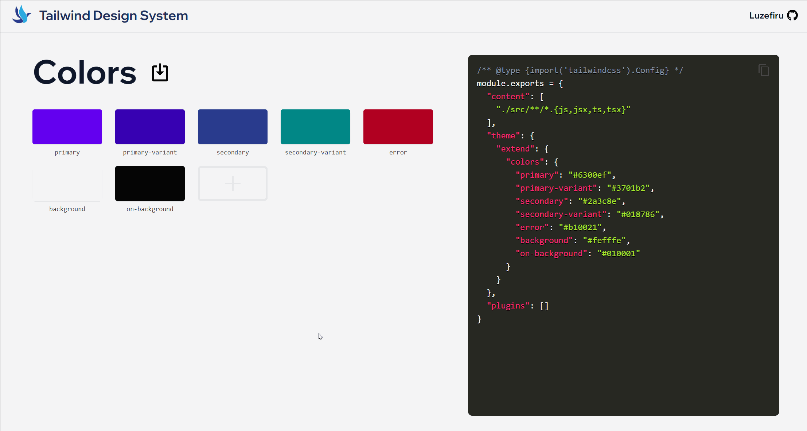

# tailwind-config-generator

A visual solution to design system setup for Tailwind CSS.




# Features

- JSON color object imports
- color picker with image upload support
- classname & HEX value validation
- copy a ready-made `tailwind.config.js` straight to your clipboard

# Usage

```bash
git clone https://github.com/Luzefiru/tailwind-config-generator.git
cd tailwind-config-generator
```

NOTE: You will need the [Docker Client](https://docs.docker.com/get-docker/) with Docker Compose in order to run `docker compose` commands.

```bash
# to start a production instance on localhost:8080
docker compose up -d
# stops the container
docker compose down

# to start a containerized dev environment with hot reload on localhost:3000, may be delayed on Windows
docker compose -f dev.docker-compose.yml up -d
# stops the container
docker compose -f dev.docker-compose.yml down
```

For local development, you can install all the dependencies and spin up a React environment.

```bash
npm ci
npm run start
```

# Credits

- <a href="https://www.vecteezy.com/free-vector/bird">Bird Vector Logo by Vecteezy</a>
